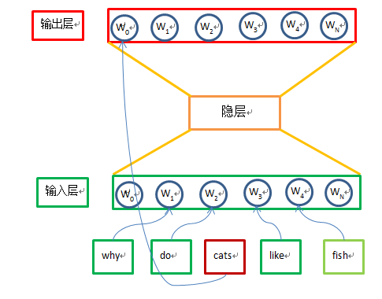

# 简介
word embedding: 在NLP中，把词或者短语从字典空间映射到实数的向量空间，用一个向量来表征词或者短语
> Word embedding is the collective name for a set of language modeling and feature learning techniques in natural language processing (NLP) where words or phrases from the vocabulary are mapped to vectors of real numbers. Conceptually it involves a mathematical embedding from a space with one dimension per word to a continuous vector space with much lower dimension.

## Continous Bag of Words（CBOW）

连续词袋模型(Continous Bag Of Words)的问题定义：

- 在一篇文档中(文章按照term长度为m)，使用一个滑动窗口(滑动窗口大小为2n + 1)从前到后滑动，生成m - (2n + 1)个片段。
- CBOW模型预测：对1个连续片段，给定前n个term 和  后n个term, 预测中间的term。
- 建模：
  * **输入**：V维(V是term字典大小)，其输入向量I中的每个元素I[k]表示单词k在当前连续片段中出现还是没有没有出现，出现用1表示，未出现用0表示。
  * **隐藏层**：采用1个隐藏层的全连接神经网络，其隐藏层的大小一般从几十到千，用N来表示隐层神经元。
  * **输出层**：V维(V是term字典大小)，其输出向量O表示给定一个片段中的前n和后n个term, 其中间的term的概率。
- 模型特点:
  * **模型大小**： V\*N(输入到隐藏层) + V\*N(隐藏层到输出层)
  * **输入说明**：每个训练样本的输入是V维的向量，但是绝对部分的输入都是0，只有2n个输入为1。
 
 

## Skip Gram
1. Make my changes
  1. Fix bug
  2. Improve formatting
    * Make the headings bigger
2. Push my commits to GitHub
3. Open a pull request
  * Describe my changes
  * Mention all the members of my team
    * Ask for feedback

# 

# Reference:
1. [word2vec Parameter Learning Explained](http://www-personal.umich.edu/~ronxin/pdf/w2vexp.pdf)
2. [word embedding wikipedia] (https://en.wikipedia.org/wiki/Word_embedding)
